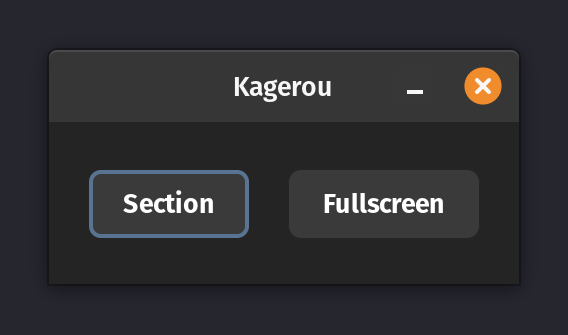

# monkeyshot-client
This is a client for the [monkeyshot](https://github.com/elderguardian/monkeyshot) server. It was written with 0 knowledge about python, shell or the gtk.

This needs a rewrite some day.

## Preview

## Installation
Just execute the `install.sh` file and it should work.
You need python, curl, jq and scrot installed.
The installer will also try to add a .desktop file.

